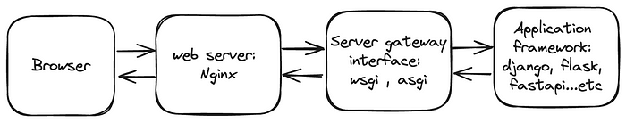

# WSGI and ASGI

## Architecture for Web server

Users connect to `Nginx` using a browser, which serves various purposes such as **web serving**, **reverse proxying**, **caching**, **load balancing**, and **media streaming**. `Nginx` can be referred to as a **`web server`**. Subsequently, `Nginx` communicates with `server gateway interfaces`, including `Web Server Gateway Interface (WSGI)` and `Asynchronous Server Gateway Interface (ASGI)`. Finally, the server gateway interface executes functions within application frameworks such as FastAPI, Django, Flask or other Python web frameworks.

The interaction between the `web server` and the `server gateway interface` is managed by a protocol that outlines the guidelines for their communication. In Python, the protocol may be the `Web Server Gateway Interface (WSGI)` or the `Asynchronous Server Gateway Interface (ASGI)`, depending on whether the application employs `synchronous` or `asynchronous` programming.



## WSGI

Originally introduced in 2003 and revised in 2010, WSGI (Web Server Gateway Interface) is a specification that outlines the communication protocol between the web server and a server gateway interface. It defines a straightforward interface for managing HTTP requests and responses, enabling developers to create web applications in Python without the need to delve into the intricacies of the underlying server.

WSGI operates by exposing a Python function to the web server, typically named ‘application’ or ‘app’ by default. This function takes two parameters: ‘environ’ and ‘start_response.’

- environ: a dictionary is required to contain these web server’s environment variables. For example, REQUEST_METHOD, PATH_INFO, QUERY_STRING…etc.
- start_response: The callable function used to begin the HTTP response.

The simple WSGI implementation is as below.

```
def application(environ, start_response):
    start_response('200 OK', [('Content-Type', 'text/plain')])
    return [b'Greetings universe']
```

Django and Flask both utilize WSGI. However, because WSGI servers operate in a synchronous manner, they handle one request at a time, blocking the connection until the result is returned. This limitation can result in scalability issues and an inability to handle WebSocket or long-polling requests.

In summary, `WSGI (Web Server Gateway Interface)` is a standard interface between web servers and Python web applications or frameworks. It defines how web servers communicate with Python applications, allowing them to handle HTTP requests and responses. WSGI enables seamless integration of Python code with web servers, making it a fundamental component for running Python web applications.

## ASGI

ASGI is a more recent specification crafted to facilitate asynchronous programming in Python. Unlike WSGI, which is tailored for synchronous requests, ASGI empowers developers to create web applications that can handle multiple requests concurrently, without impeding the main thread.

To implement ASGI, you can define a function named ‘application’ that accepts three parameters.

- `scope`: A dictionary with information about the current request, akin to environ in WSGI, but with a slightly different naming convention for the details.. For example, method, path, headers, query_string…etc.
- `receive`: An async callable (function) that lets the application send messages back to the client.
- `send`: An async callable that lets the application receive messages from the client..

```
async def application(scope, receive, send):
    await send({
        'type': 'http.response.start',
        'status': 200,
        'headers': [
            [b'content-type', b'text/plain'],
        ],
    })

    await send({
        'type': 'http.response.body',
        'body': b'Hello, world!',
    })
```

In summary, `ASGI (Asynchronous Server Gateway Interface)` is a standard interface for asynchronous web servers to communicate with Python web applications or frameworks. Unlike WSGI, which is synchronous, ASGI allows handling multiple requests concurrently without blocking other requests. It’s particularly useful for real-time applications, long-lived connections, and efficient handling of WebSocket connections. ASGI servers, such as Daphne and Uvicorn, support asynchronous programming in Python.

## WSGI vs ASGI

The difference between `ASGI (Asynchronous Server Gateway Interface)` and `WSGI (Web Server Gateway Interface)` lies in their handling of requests and concurrency:

#### `WSGI (Web Server Gateway Interface)`:

- `Synchronous`: Processes requests one at a time, blocking execution until processing is complete.
- `Concurrency`: Achieves concurrency through processes or threads.
- `Protocol Support`: Supports HTTP only (lacks WebSocket support).
- `Middleware Compatibility`: Middleware is synchronous, impacting performance in asynchronous applications.
- `Servers`: Popular WSGI servers include Gunicorn and mod_wsgi.

#### `ASGI (Asynchronous Server Gateway Interface)`:

- `Asynchronous`: Handles multiple requests concurrently without blocking other requests.
- `Concurrency and Scalability`: Efficiently handles concurrency, recommended for long-lived connections or many clients.
- `Protocol Support`: Supports both HTTP and WebSocket, ideal for real-time bidirectional communication.
- `Middleware Compatibility`: Middleware is asynchronous, ensuring compatibility with asynchronous applications.
- `Servers`: Popular ASGI servers include Daphne and Uvicorn.

In summary, WSGI is suitable for synchronous applications, while ASGI is designed for asynchronous applications with real-time capabilities and efficient handling of WebSocket connections.

### Study material
- [GeekForGeeks.org](https://www.geeksforgeeks.org/difference-between-asgi-and-wsgi-in-django/)
- [SkillApp.co](https://skillapp.co/blog/asgi-vs-wsgi-understanding-the-differences-and-choosing-the-right-framework-for-your-web-application/)
- [InfoWorld.com](https://www.infoworld.com/article/3658336/asgi-explained-the-future-of-python-web-development.html)
- [WSGI vs ASGI for Python Web Development @medium.com](https://medium.com/@commbigo/wsgi-vs-asgi-for-python-web-development-9d9a3c426aa9)