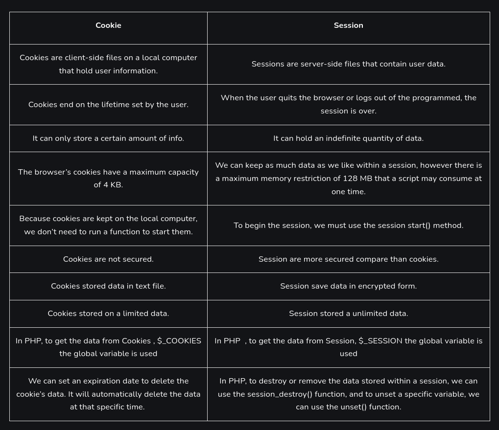

# Session vs Cookies
In web development, sessions and cookies are essential for managing user data and state across multiple requests. Understanding their differences, advantages, and use cases is crucial for designing robust web applications.

## Session
A session is a server-side storage of user data that is used to persist state and data across multiple requests from the same user during a browsing session.

### Characteristics
- `Server-Side Storage`: Data is stored on the server, with a unique session ID sent to the client.
- `Short-Lived`: Sessions typically expire after a certain period of inactivity or when the user closes the browser.
- `Security`: More secure than cookies since the data is stored on the server.
- `State Management`: Maintains user state and data across multiple pages.

### Example
Imagine a user logging into an e-commerce website. The server creates a session to store user-specific data like authentication status, shopping cart items, and user preferences. The session ID is stored in a cookie on the client-side, and with each subsequent request, the session ID is sent to the server to retrieve the session data.

### Advantages
- `Security`: Sensitive information is kept on the server, reducing the risk of client-side manipulation.
- `Stateful Interactions`: Enables complex workflows that depend on maintaining state across multiple requests.

### Disadvantages
- `Scalability`: Managing sessions can become resource-intensive, particularly for applications with a large number of users.
- `Server Dependency`: Session data is stored on the server, making it harder to scale horizontally without additional infrastructure.

## Cookies
Cookies are small pieces of data stored on the client-side that the server can read and write. They are used to remember information about the user between requests.

### Characteristics
- `Client-Side Storage`: Data is stored in the user's browser.
- `Persistent`: Cookies can persist across multiple sessions and have an expiration date set by the server.
- `Size Limitation`: Each cookie can typically store up to 4KB of data.
- `Stateless`: Does not inherently maintain state, but can be used to store session IDs or other state identifiers.

### Example
A website might use cookies to remember a user's language preference. When the user selects a language, the preference is stored in a cookie. On subsequent visits, the website reads the cookie and displays the site in the user's preferred language.

### Advantages
- `Persistence`: Can remember user preferences and data across multiple sessions.
- `Lightweight`: Offloads storage to the client-side, reducing server load.
- `Simple Implementation`: Easy to implement and use for storing small pieces of information.

### Disadvantages
- `Security`: More vulnerable to client-side attacks such as cross-site scripting (XSS).
- `Data Limitations`: Limited in size and number, making them unsuitable for storing large amounts of data.
- `Privacy Concerns`: Can be used to track users, raising privacy issues.

## Comparison

**Diagram**: _Cookie vs Session_

#### Resources
- [GeeksForGeeks.org](https://www.geeksforgeeks.org/difference-between-session-and-cookies/)