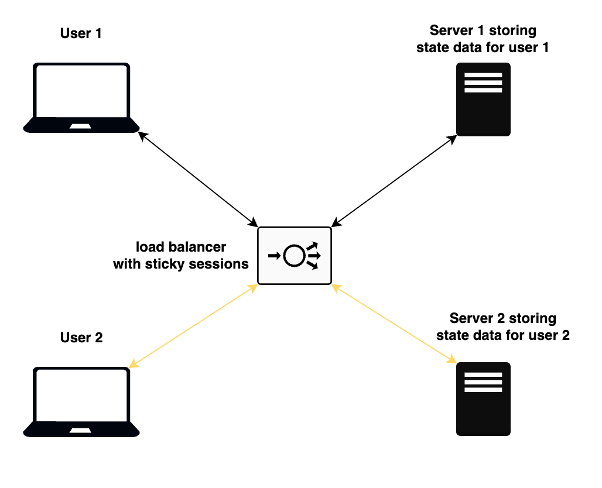
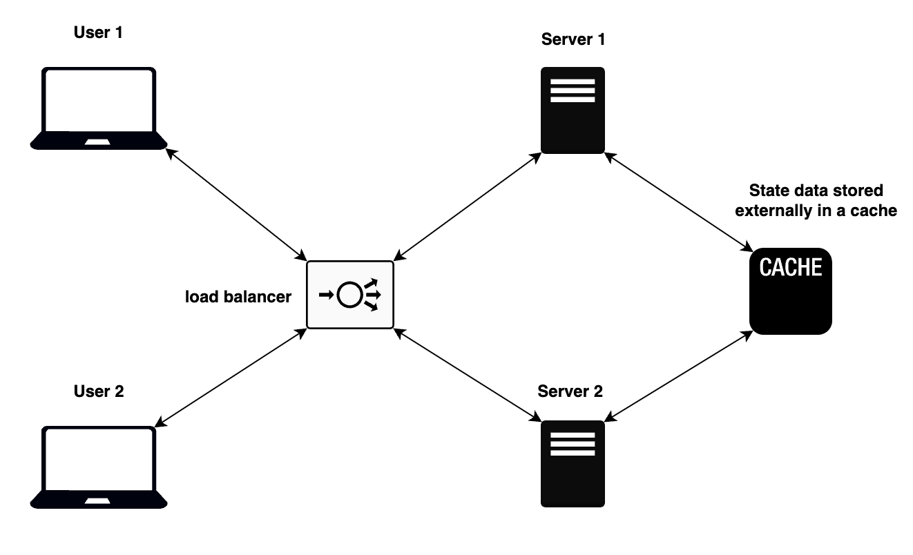
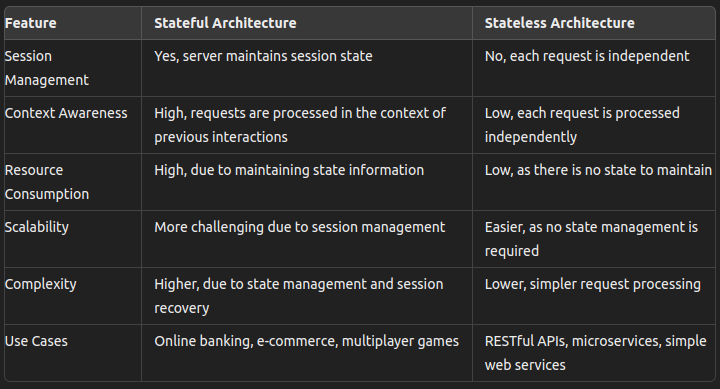

# State
In programming, `state` refers to the condition of a system, component, or application at a particular point in time.

`State` represents the data that is stored and used to keep track of the current status of the application. Understanding and managing `state` is crucial for building interactive and dynamic web applications.

The concept of a `state` crosses many boundaries in architecture. Design patterns (like REST and GraphQL), protocols (like HTTP and TCP), firewalls and functions can be stateful or stateless. But the underlying principle of `state` cutting across all of these domains remains the same.

## Stateful
`Stateful architecture` is one where the server maintains the state of interactions with clients. This means that the server keeps track of the information about the client's session and can provide context-aware responses based on the state of the client's previous requests.

**Diagram**: _Stateful application works_

The diagram shows two different users trying to access a web server through a load balancer. Since the application state is maintained on the servers, the users must always be routed to the same server for every single request in order to preserve state.

Sticky sessions is a configuration that allows the load balancer to route a user's requests consistently to the same backend server for the duration of their session. This is in contrast to traditional load balancing, where requests from a user can be directed to any available backend server in a round-robin or other load distribution pattern.

### Characteristics
- `Session Management`: The server retains information about the client sessions, typically using mechanisms like cookies, session IDs, or tokens.
- `Context Awareness`: Each request is understood in the context of previous requests from the same client.
- `Resource Intensive`: Maintaining state can be resource-intensive as the server needs to store session data and manage multiple client sessions concurrently.
- `Examples`: Online banking systems, multiplayer online games, and e-commerce applications often rely on stateful architectures for features like user authentication, shopping carts, and personalized experiences.

### Advantages
- Provides a seamless and personalized user experience by maintaining context.
- Enables complex interactions and workflows that depend on the continuity of client-server communication.

### Disadvantages
- Scalability challenges due to the need to manage and store state information.
- Increased complexity in handling server failures and session recovery.

## Stateless
`Stateless architecture` is one where the server does not retain any information about the client's state between requests. Each request from the client to the server must contain all the information needed to understand and process the request.

**Diagram**: _Stateless application works_

The diagram shows two different users trying to access a web server through a load balancer. Since the application state is maintained separately from the servers, the users can be routed to any of the servers, which will then get the state information from an external database accessible by both servers.

The load will also be equally distributed across all servers, since the load balancer will not need a sticky session configuration to route the same clients to the same servers.

### Characteristics
- `No Session Management`: Each request is independent, and the server does not need to store any state information about the client.
- `Idempotency`: Requests are typically idempotent, meaning that making the same request multiple times will produce the same result.
- `Scalability`: Stateless systems are generally easier to scale as there is no need to manage session state.
- `Examples`: RESTful APIs, which are designed to be stateless, where each HTTP request contains all the necessary information for the server to fulfill the request.

### Advantages
- Easier to scale horizontally since there is no session state to manage.
- Simplified recovery from server failures as no session data needs to be recovered or synchronized.
- Reduced server-side complexity as each request is self-contained.

### Disadvantages
- Less efficient for scenarios requiring frequent stateful interactions as the client must send all relevant data with each request.
- Can lead to larger payloads in requests as all context information must be included.

## Comparison

**Diagram**: _Statefull vs Stateless_

#### References
- [freeCodeCamp.org](https://www.freecodecamp.org/news/stateful-vs-stateless-architectures-explained/)