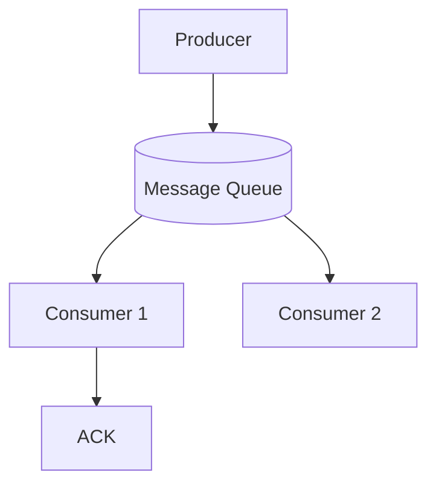

# 📦 Message Queue

## 🧩 Overview

A **Message Queue (MQ)** is a communication mechanism that allows different components of a system to **exchange data asynchronously**.

It temporarily stores messages in a queue until the receiving service is ready to process them — ensuring **reliability**, **decoupling**, and **fault tolerance** in distributed architectures.

Message Queues are widely used in **microservices**, **event-driven systems**, and **background job processing**.

Message Queues enable asynchronous communication between distributed services by storing messages until they are processed.

They decouple producers and consumers, smooth out load spikes, and ensure reliability in event-driven architectures.

---

## ⚙️ How It Works

A Message Queue follows a simple flow:

1. **Producer** — sends (publishes) a message into the queue.  
2. **Broker** — stores the message until it’s processed.  
3. **Consumer** — retrieves (consumes) the message from the queue.  
4. **Acknowledgment (ACK)** — once processed successfully, the consumer acknowledges; the broker removes the message.  
5. **Retry / DLQ (optional)** — if a consumer fails to process the message, it can be retried or sent to a *dead-letter queue*.

```text
Producer  →  [ Message Queue ]  →  Consumer
                ↑    ↓
             Stored  ACK
```

If processing fails, the message can be retried or moved to a **Dead-Letter Queue (DLQ)** for later analysis.



## 🧱 Key Characteristics

| Concept               | Description                                        |
| --------------------- | -------------------------------------------------- |
| **Asynchronous**      | Producers and consumers operate independently.     |
| **Durable**           | Messages persist until processed or acknowledged.  |
| **Reliable Delivery** | Guarantees that no message is lost.                |
| **Load Buffering**    | Handles sudden spikes in workload.                 |
| **Fault Tolerant**    | Consumers can crash and recover without data loss. |

## 🧩 Common Components

| Component                   | Role                                                                   |
| --------------------------- | ---------------------------------------------------------------------- |
| **Producer**                | Sends messages to the queue.                                           |
| **Broker**                  | Manages queues, storage, routing, and delivery.                        |
| **Consumer**                | Retrieves and processes messages.                                      |
| **ACK (Acknowledgment)**    | Confirms message was processed successfully.                           |
| **DLQ (Dead-Letter Queue)** | Stores messages that failed repeatedly.                                |
| **Visibility Timeout**      | Hides messages temporarily while being processed to avoid duplication. |

## 🧠 Why Message Queues Matter

| Problem                         | How Message Queues Help                   |
| ------------------------------- | ----------------------------------------- |
| Tight coupling between services | Decouples communication                   |
| Traffic spikes or burst loads   | Buffers requests until consumers catch up |
| Service downtime                | Stores messages until recovery            |
| Long-running tasks              | Moves heavy work to background            |
| Data loss risk                  | Ensures guaranteed delivery               |

## 🧩 Message Queue Types

| Type                        | Description                                    | Example Use             |
| --------------------------- | ---------------------------------------------- | ----------------------- |
| **Standard Queue**          | Default queue type; unordered, high throughput | Logging, analytics jobs |
| **FIFO Queue**              | First-In, First-Out message order              | Payments, workflows     |
| **Delayed Queue**           | Delivers messages after a fixed delay          | Scheduled notifications |
| **Dead-Letter Queue (DLQ)** | Stores failed messages                         | Error debugging         |
| **Priority Queue**          | Processes higher-priority tasks first          | Task scheduling         |

## 🔄 Delivery Guarantees

| Guarantee         | Description                                       |
| ----------------- | ------------------------------------------------- |
| **At Most Once**  | Message might be lost but never redelivered.      |
| **At Least Once** | Message may be redelivered (possible duplicates). |
| **Exactly Once**  | Message processed only once (complex to achieve). |

## ⚙️ Example Use Case: CRM Lead Processing

When a new lead is created:

- CRM service publishes a lead.created event to the queue.
- Email service consumes the message → sends welcome email.
- Notification service consumes the same event → alerts the BDE.
- Analytics service logs the event → updates dashboards.
- Each service processes independently without slowing down the CRM API.

> **📘 In short**: A Message Queue is the backbone of reliable communication between distributed components — ensuring every message is processed, even when systems fail or scale dynamically.

### Topics
- [Core Concepts](./concepts.md)
- [Queue Types](./types.md)
- [Delivery Guarantees](./guarantees.md)
- [Example Workflows](./examples.md)
