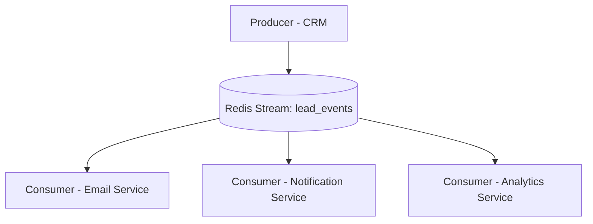

# 🔁 Redis Streams

## 🧩 Overview

**Redis Streams** is a data structure introduced in Redis 5.0 that provides a **persistent, log-based message queue** built directly into Redis.  
It combines the simplicity of Redis with reliable messaging features such as **message persistence**, **consumer groups**, and **acknowledgments** — making it a powerful alternative to transient Redis Pub/Sub.

In short:
> Redis Streams = Pub/Sub + Persistence + Replay + Acknowledgment

---

## ⚙️ Key Concepts

| Term | Description |
|------|--------------|
| **Stream** | A log-like structure that stores messages in order, similar to Kafka topics. |
| **Entry** | A single message in the stream, consisting of an ID and key-value pairs. |
| **Producer** | Adds messages to a stream using `XADD`. |
| **Consumer** | Reads messages using `XREAD` or from a consumer group via `XREADGROUP`. |
| **Consumer Group** | A group of consumers that share the workload of processing stream entries. |
| **Pending Entries** | Messages that were delivered but not yet acknowledged (tracked by Redis). |
| **Acknowledgment (ACK)** | Marks a message as successfully processed using `XACK`. |

---

## 🧱 Stream Structure

Each entry in a Redis stream looks like this:

```
Stream: leads
ID: 1727961512345-0
Fields:
  event_type: lead.created
  lead_id: 101
  created_by: shaon
```


Entries are stored in append-only order and can be replayed or fetched by ID.

---

## 🧩 Basic Commands

### ➕ Add Message

```bash
XADD leads * event_type lead.created lead_id 101 created_by shaon
```

- `leads`: stream name
- `*`: auto-generate ID
- `key value ...`: message fields

### 📖 Read Messages
```bash
XREAD COUNT 2 STREAMS leads 0
```

Reads messages from the beginning (`0`) or from the latest ID (`$`).

## 👥 Consumer Groups

Consumer groups enable distributed consumption — multiple consumers can process messages without duplication.

### 1️⃣ Create a Group

```bash
XGROUP CREATE leads group1 $ MKSTREAM
```

Creates a group named `group1` starting from the first message.

### 2️⃣ Read as a Consumer

```bash
XREADGROUP GROUP group1 consumer1 COUNT 1 STREAMS leads >
```

Reads new messages for `consumer1` in `group1`.

### 3️⃣ Acknowledge Processed Message

```bash
XACK leads group1 1727961512345-0
```

### 4️⃣ Check Pending Messages

```bash
XPENDING leads group1
```

Shows unacknowledged (in-flight) messages.

## 🔁 Replay & Recovery

If a consumer crashes before acknowledging:

- Redis retains the message in the **pending list**.
- Another consumer can claim it using:

```bash
XCLAIM leads group1 consumer2 60000 1727961512345-0
```

This transfers ownership after a 60-second idle time.

## 💡 Redis Streams vs Pub/Sub

| Feature           | Redis Pub/Sub   | Redis Streams |
| ----------------- | --------------- | ------------- |
| Persistence       | ❌ No            | ✅ Yes         |
| Offline Consumers | ❌ Miss messages | ✅ Can replay  |
| Acknowledgments   | ❌ No            | ✅ Yes         |
| Message Ordering  | ✅ Yes           | ✅ Yes         |
| Consumer Groups   | ❌ No            | ✅ Yes         |
| Replay            | ❌ No            | ✅ Yes         |

> 🔹 Redis Streams is the reliable, fault-tolerant upgrade to traditional Pub/Sub.

## ⚙️ Example Architecture (Mermaid)


## 🧰 Python Example (Async)

```python
import asyncio
import aioredis

STREAM = "lead_events"
GROUP = "crm_services"
CONSUMER = "email_service"

async def main():
    redis = aioredis.from_url("redis://localhost")

    # Ensure group exists
    try:
        await redis.xgroup_create(STREAM, GROUP, id="$", mkstream=True)
    except aioredis.exceptions.ResponseError:
        pass  # Group already exists

    while True:
        messages = await redis.xreadgroup(
            groupname=GROUP,
            consumername=CONSUMER,
            streams={STREAM: ">"},
            count=1,
            block=5000,  # wait up to 5s
        )
        if messages:
            for stream, entries in messages:
                for msg_id, data in entries:
                    print(f"Processing {msg_id}: {data}")
                    # TODO: process message
                    await redis.xack(STREAM, GROUP, msg_id)

asyncio.run(main())
```

## 🧠 When to Use Redis Streams

### ✅ When you need:

- Lightweight, reliable message queue
- Persistence and replay capability
- Consumer group management
- Minimal setup (single Redis dependency)

### ⚠️ Avoid when:
- You need massive throughput (Kafka is better)
- You require cross-data-center durability
- You need complex routing or fan-out (RabbitMQ is better)

## 🧠 Persistence & Memory Note

Since Redis is in-memory, mention persistence modes briefly:

> Redis Streams data is persisted via **RDB snapshots** or **AOF logs** (Append-Only File). Choose based on your durability vs performance needs.


## ✅ Summary
| Feature         | Description                                   |
| --------------- | --------------------------------------------- |
| **Type**        | Persistent log-based message queue            |
| **Delivery**    | At-least-once (with acknowledgment)           |
| **Persistence** | Yes (stored in Redis memory + disk snapshot)  |
| **Scalability** | Suitable for small to medium workloads        |
| **Use Case**    | Microservices, background jobs, notifications |

> **📘 In short**:
Redis Streams turns Redis into a durable, replayable, and fault-tolerant message queue, bridging the gap between Pub/Sub and full-scale brokers like Kafka or RabbitMQ.

#### 🔗 References

- [Redis Streams Official Documentation](https://redis.io/docs/latest/develop/data-types/streams/)
- [Redis XADD Command](https://redis.io/commands/xadd/)
- [Redis Consumer Groups Guide](https://redis.io/docs/latest/develop/data-types/streams/#consumer-groups)
