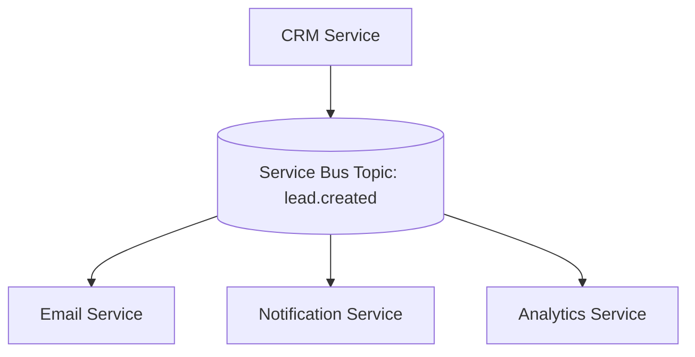

# 🧠 Service Bus

## 🧩 Overview

A **Service Bus** is an enterprise-grade messaging system that provides a **central communication backbone** for microservices.  
It builds on the core idea of **message queues** but adds advanced features like **topics, subscriptions, filtering, transactions, retries**, and **monitoring**.

Think of it as:
> **Message Queue + Routing + Reliability + Observability**

It allows microservices to **communicate asynchronously** without depending on each other’s availability — enabling a fully decoupled, scalable architecture.

---

## ⚙️ Core Concepts

| Concept | Description |
|----------|-------------|
| **Queue** | Stores messages for point-to-point (1:1) communication between producer and consumer. |
| **Topic** | Enables publish/subscribe (1:N) broadcasting — multiple services can receive the same message. |
| **Subscription** | A consumer endpoint attached to a topic; can filter which messages it receives. |
| **Broker** | The central service that routes, stores, and delivers messages (e.g., Azure Service Bus, RabbitMQ, Kafka). |
| **ACK (Acknowledgment)** | Confirms a message has been processed successfully. |
| **DLQ (Dead Letter Queue)** | Stores failed messages for review and reprocessing. |
| **Transaction** | Ensures atomic publishing and consuming of multiple messages. |

---

## 🧱 Architecture Overview

```mermaid
graph TD

  subgraph A[Producers]
    A1[CRM Service]
    A2[Auth Service]
    A3[Partner Service]
  end

  subgraph B[(Service Bus)]
    B1[Queue - Point-to-Point]
    B2[Topic - Publish/Subscribe]
    B3[DLQ - Dead Letter Queue]
  end

  subgraph C[Consumers]
    C1[Notification Service]
    C2[Email Service]
    C3[Analytics Service]
    C4[Integration Service]
  end

  A1 -->|Send Message| B1
  A2 -->|Publish Event| B2
  A3 -->|Publish Event| B2

  B1 -->|Process| C1
  B2 -->|Subscription 1| C2
  B2 -->|Subscription 2| C3
  B2 -->|Subscription 3| C4

  C2 -->|Failed Msg| B3
  C3 -->|Failed Msg| B3
```

## 🧠 How It Works

- `Producers` (e.g., CRM, Auth) send messages to the Service Bus.
- The Service Bus routes messages to:
    - A `queue`, if it’s one-to-one (e.g., CRM → Notification)
    - A `topic`, if it’s one-to-many (e.g., CRM → Email, Analytics, Partner)
- `Consumers` receive and process messages asynchronously.
- After processing, the consumer `ACKs` the message.
- Failed messages are automatically moved to a `Dead Letter Queue (DLQ)` for later analysis.

## 🧩 Message Queue vs Service Bus

| Feature       | Message Queue                      | Service Bus                                   |
| ------------- | ---------------------------------- | --------------------------------------------- |
| Communication | Point-to-Point                     | Point-to-Point + Publish/Subscribe            |
| Routing       | Static                             | Dynamic (topics, filters, sessions)           |
| Transactions  | Basic                              | Fully supported                               |
| DLQ           | Optional                           | Built-in                                      |
| Filtering     | Not available                      | Advanced (subscription rules)                 |
| Monitoring    | Limited                            | Built-in metrics, retries, tracking           |
| Examples      | Redis Streams, SQS, RabbitMQ Queue | Azure Service Bus, Kafka, NATS, AWS SNS + SQS |

## 🧰 Example Use Case: Microservice CRM

When a new lead is created in the CRM system:

- CRM Service publishes a lead.created event to the Service Bus topic.
- Email Service (subscriber) sends a welcome email.
- Notification Service (subscriber) alerts the assigned BDE.
- Analytics Service (subscriber) logs the lead event for dashboards.
- If any service fails → message stays in its subscription queue until retry.



## ⚙️ Features of a Service Bus

| Feature                    | Description                                              |
| -------------------------- | -------------------------------------------------------- |
| **Queues**                 | Reliable FIFO storage for single-consumer communication. |
| **Topics & Subscriptions** | Pub/Sub delivery to multiple consumers.                  |
| **Dead Letter Queue**      | Automatic handling of failed messages.                   |
| **Sessions**               | Preserves ordering for related messages.                 |
| **Duplicate Detection**    | Prevents processing of the same message twice.           |
| **Auto Forwarding**        | Moves messages between queues/topics automatically.      |
| **Transactions**           | Ensures atomic operations on multiple messages.          |
| **Retry Policies**         | Configurable automatic retries before DLQ.               |

## 🔗 Common Implementations

| Platform         | Service                                      | Description                                                |
| ---------------- | -------------------------------------------- | ---------------------------------------------------------- |
| **Azure**        | Service Bus                                  | Full-featured enterprise messaging with queues and topics. |
| **AWS**          | SNS + SQS                                    | Combined for pub/sub and queue behavior.                   |
| **Google Cloud** | Pub/Sub                                      | Scalable, managed message bus.                             |
| **RabbitMQ**     | Exchange + Queue                             | Self-managed, open source option.                          |
| **Kafka / NATS** | Distributed streaming and event bus systems. |                                                            |

## ✅ Summary
| Aspect                   | Description                                          |
| ------------------------ | ---------------------------------------------------- |
| **Type**                 | Advanced message broker with routing and persistence |
| **Purpose**              | Decoupled, reliable inter-service communication      |
| **Core Building Blocks** | Queues, Topics, Subscriptions, DLQs                  |
| **Delivery Mode**        | At least once / Exactly once                         |
| **Use Case**             | Microservice communication backbone                  |
| **Examples**             | Azure Service Bus, AWS SNS + SQS, Kafka, NATS        |

> **📘 In short**: A Service Bus extends the concept of a Message Queue into a full-scale event-driven communication system — ideal for large, distributed microservice architectures.

